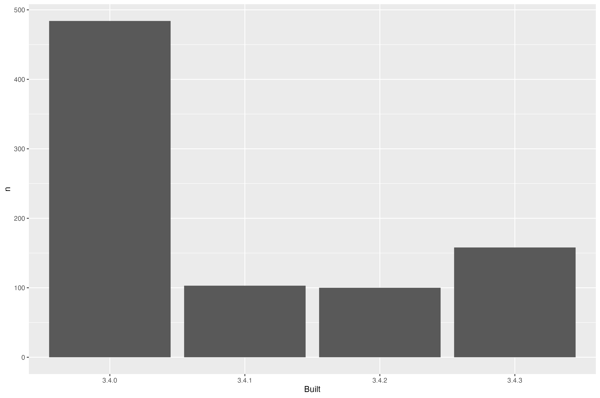

<!-- README.md is generated from README.Rmd. Please edit that file -->


# packages-report

## Bonus activity prompt

* Combine your work analyzing your R packages and what we've learned re: GitHub and R Markdown
* This `README.Rmd` gives a scaffold for using the work you did earlier to make a little report.
* Given our previous work, I'm using pre-computed results and including a pre-made figure, leaving the R code down in scripts below `R/`. But know that, in other contexts, you could inline all that code in chunks here. Depends on downstream usage and the project context.
* Locally, do `README.Rmd` --> `README.md` with the "Knit" button or via `rmarkdown::render("README.Rmd")`. Commit both.
* I presume you are hooked up to GitHub remote repo, covered in [Existing project, GitHub last](https://happygitwithr.com/existing-github-last.html). Summary:
  - Consider the convenience functions `usethis::use_git()` + `usethis::use_github()`. Or to do by hand:
  - Create a similarly-named repo on GitHub.
  - Add it to the local repo as the `origin` remote: `git remote add origin https://github.com/YOU/REPO.git`.
  - Push and cement the branch tracking relationship: `git push --set-upstream origin master`.
* Push! Now your README is an excellent welcome mat and summary of your project.
* On GitHub, in *Settings*, turn on GitHub Pages. Visit the given URL for an even more polished report of your project. It may take a few minutes to show up / update. Record that as the URL for your repo.

## Overview

The goal of packages-report is to FINISH THIS SENTENCE.


I have `FILL THIS IN!!!` add-on packages installed.

Here's how they break down in terms of which version of R they were built under, which is related to how recently they were updated on CRAN.




### Flow of the analysis

*If you have time, document the analysis works, using internal links.*

*If you created some sort of controller script, describe that here.*

<details>

<summary>Session info</summary>

```r
devtools::session_info()
#> ─ Session info ───────────────────────────────────────────────────────────────
#>  setting  value
#>  version  R version 4.3.1 (2023-06-16)
#>  os       macOS Ventura 13.4
#>  system   aarch64, darwin20
#>  ui       X11
#>  language (EN)
#>  collate  en_US.UTF-8
#>  ctype    en_US.UTF-8
#>  tz       America/Chicago
#>  date     2023-09-17
#>  pandoc   3.1.1 @ /Applications/RStudio.app/Contents/Resources/app/quarto/bin/tools/ (via rmarkdown)
#> 
#> ─ Packages ───────────────────────────────────────────────────────────────────
#>  package     * version date (UTC) lib source
#>  cachem        1.0.8   2023-05-01 [1] CRAN (R 4.3.0)
#>  callr         3.7.3   2022-11-02 [1] CRAN (R 4.3.0)
#>  cli           3.6.1   2023-03-23 [1] CRAN (R 4.3.0)
#>  colorspace    2.1-0   2023-01-23 [1] RSPM (R 4.3.1)
#>  crayon        1.5.2   2022-09-29 [1] CRAN (R 4.3.0)
#>  devtools      2.4.5   2022-10-11 [1] CRAN (R 4.3.0)
#>  digest        0.6.33  2023-07-07 [1] CRAN (R 4.3.0)
#>  dplyr       * 1.1.3   2023-09-03 [1] RSPM (R 4.3.1)
#>  ellipsis      0.3.2   2021-04-29 [1] CRAN (R 4.3.0)
#>  evaluate      0.21    2023-05-05 [1] CRAN (R 4.3.0)
#>  fansi         1.0.4   2023-01-22 [1] RSPM (R 4.3.1)
#>  fastmap       1.1.1   2023-02-24 [1] CRAN (R 4.3.0)
#>  forcats     * 1.0.0   2023-01-29 [1] CRAN (R 4.3.0)
#>  fs            1.6.3   2023-07-20 [1] CRAN (R 4.3.0)
#>  generics      0.1.3   2022-07-05 [1] RSPM (R 4.3.1)
#>  ggplot2     * 3.4.3   2023-08-14 [1] RSPM (R 4.3.1)
#>  glue          1.6.2   2022-02-24 [1] CRAN (R 4.3.0)
#>  gtable        0.3.4   2023-08-21 [1] RSPM (R 4.3.1)
#>  hms           1.1.3   2023-03-21 [1] CRAN (R 4.3.0)
#>  htmltools     0.5.6   2023-08-10 [1] CRAN (R 4.3.0)
#>  htmlwidgets   1.6.2   2023-03-17 [1] CRAN (R 4.3.0)
#>  httpuv        1.6.11  2023-05-11 [1] CRAN (R 4.3.0)
#>  knitr         1.43    2023-05-25 [1] CRAN (R 4.3.0)
#>  later         1.3.1   2023-05-02 [1] CRAN (R 4.3.0)
#>  lifecycle     1.0.3   2022-10-07 [1] CRAN (R 4.3.0)
#>  lubridate   * 1.9.2   2023-02-10 [1] CRAN (R 4.3.0)
#>  magrittr      2.0.3   2022-03-30 [1] CRAN (R 4.3.0)
#>  memoise       2.0.1   2021-11-26 [1] CRAN (R 4.3.0)
#>  mime          0.12    2021-09-28 [1] RSPM (R 4.3.1)
#>  miniUI        0.1.1.1 2018-05-18 [1] CRAN (R 4.3.0)
#>  munsell       0.5.0   2018-06-12 [1] RSPM (R 4.3.1)
#>  pillar        1.9.0   2023-03-22 [1] RSPM (R 4.3.1)
#>  pkgbuild      1.4.2   2023-06-26 [1] CRAN (R 4.3.0)
#>  pkgconfig     2.0.3   2019-09-22 [1] RSPM (R 4.3.1)
#>  pkgload       1.3.2.1 2023-07-08 [1] CRAN (R 4.3.0)
#>  prettyunits   1.1.1   2020-01-24 [1] CRAN (R 4.3.0)
#>  processx      3.8.2   2023-06-30 [1] CRAN (R 4.3.0)
#>  profvis       0.3.8   2023-05-02 [1] CRAN (R 4.3.0)
#>  promises      1.2.1   2023-08-10 [1] CRAN (R 4.3.0)
#>  ps            1.7.5   2023-04-18 [1] CRAN (R 4.3.0)
#>  purrr       * 1.0.2   2023-08-10 [1] CRAN (R 4.3.0)
#>  R6            2.5.1   2021-08-19 [1] CRAN (R 4.3.0)
#>  Rcpp          1.0.11  2023-07-06 [1] RSPM (R 4.3.1)
#>  readr       * 2.1.4   2023-02-10 [1] CRAN (R 4.3.0)
#>  remotes       2.4.2.1 2023-07-18 [1] CRAN (R 4.3.0)
#>  rlang         1.1.1   2023-04-28 [1] CRAN (R 4.3.0)
#>  rmarkdown     2.24    2023-08-14 [1] CRAN (R 4.3.0)
#>  rstudioapi    0.15.0  2023-07-07 [1] CRAN (R 4.3.0)
#>  scales        1.2.1   2022-08-20 [1] RSPM (R 4.3.1)
#>  sessioninfo   1.2.2   2021-12-06 [1] CRAN (R 4.3.0)
#>  shiny         1.7.5   2023-08-12 [1] CRAN (R 4.3.0)
#>  stringi       1.7.12  2023-01-11 [1] CRAN (R 4.3.0)
#>  stringr     * 1.5.0   2022-12-02 [1] CRAN (R 4.3.0)
#>  tibble      * 3.2.1   2023-03-20 [1] RSPM (R 4.3.1)
#>  tidyr       * 1.3.0   2023-01-24 [1] RSPM (R 4.3.1)
#>  tidyselect    1.2.0   2022-10-10 [1] RSPM (R 4.3.1)
#>  tidyverse   * 2.0.0   2023-02-22 [1] CRAN (R 4.3.0)
#>  timechange    0.2.0   2023-01-11 [1] CRAN (R 4.3.0)
#>  tzdb          0.4.0   2023-05-12 [1] CRAN (R 4.3.0)
#>  urlchecker    1.0.1   2021-11-30 [1] CRAN (R 4.3.0)
#>  usethis       2.2.2   2023-07-06 [1] CRAN (R 4.3.0)
#>  utf8          1.2.3   2023-01-31 [1] RSPM (R 4.3.1)
#>  vctrs         0.6.3   2023-06-14 [1] CRAN (R 4.3.0)
#>  withr         2.5.0   2022-03-03 [1] CRAN (R 4.3.0)
#>  xfun          0.40    2023-08-09 [1] CRAN (R 4.3.0)
#>  xtable        1.8-4   2019-04-21 [1] CRAN (R 4.3.0)
#>  yaml          2.3.7   2023-01-23 [1] CRAN (R 4.3.0)
#> 
#>  [1] /Library/Frameworks/R.framework/Versions/4.3-arm64/Resources/library
#> 
#> ──────────────────────────────────────────────────────────────────────────────
```

</details>

*See <https://github.com/jennybc/wtf-packages-report-EXAMPLE> for a fully realized example.*
